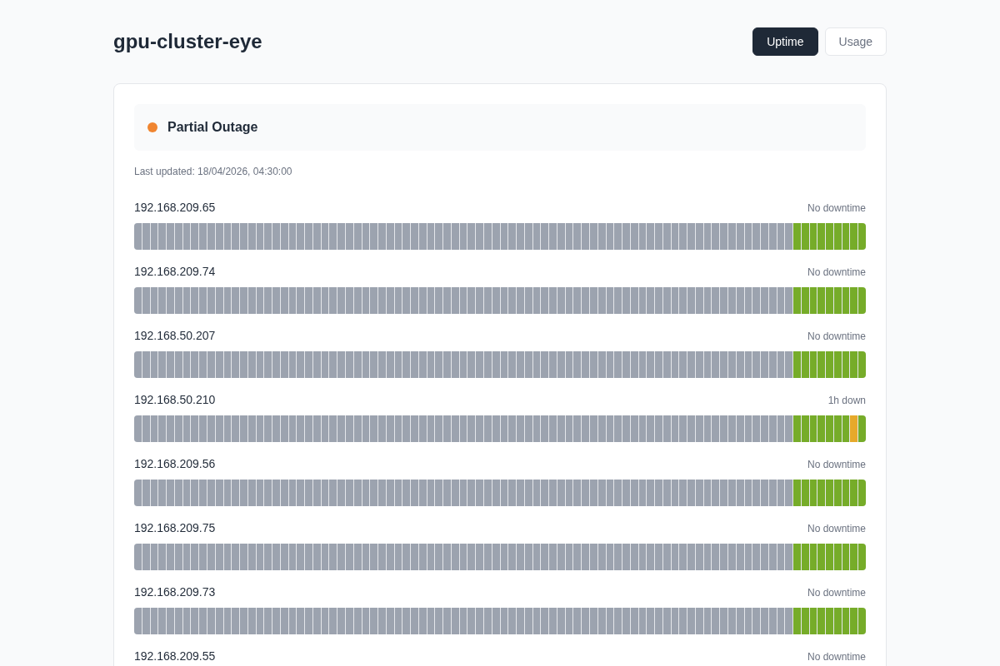
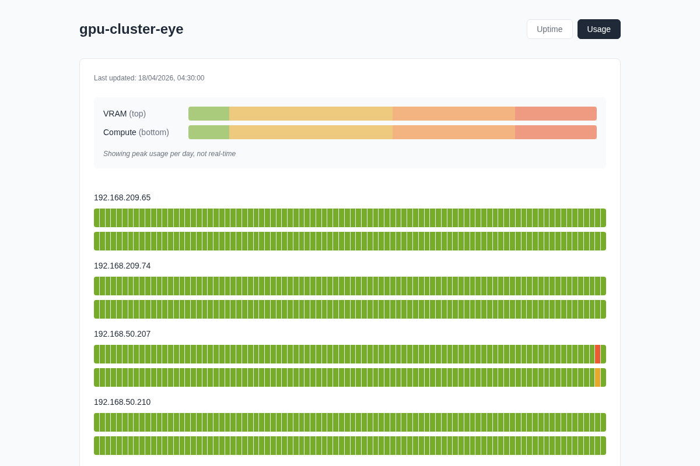

# gpu-cluster-eye

Lightweight GPU cluster monitoring dashboard. Track uptime and usage (VRAM + Compute) across multiple servers over 90 days. Static site hosted on GitHub Pages — no dedicated server required.





## Features

- **Uptime tracking** — Hours down per day, with network issue detection
- **VRAM & Compute usage** — Peak usage per day across all GPUs
- **90-day history** — Rolling window, automatic pruning
- **Static hosting** — GitHub Pages, no backend server needed
- **SSH-based collection** — Works with any Linux server running nvidia-smi

## Quick Start

```bash
# Clone
git clone https://github.com/YOUR_USERNAME/gpu-cluster-eye.git
cd gpu-cluster-eye

# Install dependencies
pip install paramiko pyyaml

# Configure servers
cp servers.example.yaml servers.yaml
# Edit servers.yaml with your SSH credentials

# Test
python3 src/collector.py --dry-run

# Run and push
python3 src/collector.py
```

## Setup Cron (Hourly Collection)

Run the cron on **one machine** that can:
- SSH to all GPU servers
- Push to the git repo

This is typically one of your GPU servers or a management node.

```bash
# On your chosen collector machine:
crontab -e

# Add:
0 * * * * cd /path/to/gpu-cluster-eye && python3 src/collector.py >> /var/log/gpu-cluster-eye.log 2>&1
```

If the collector machine goes down, the dashboard shows gray "no data" bars for those hours.

## Enable GitHub Pages

1. Push to GitHub
2. Settings → Pages → Source: `main` branch, `/public` folder
3. Access at: `https://YOUR_USERNAME.github.io/gpu-cluster-eye/`

## Configuration

`servers.yaml`:
```yaml
servers:
  - name: gpu-node-01        # Display name
    host: 192.168.1.10       # IP or hostname
    user: admin              # SSH user
    password: secret         # Or use key_file instead
    # key_file: ~/.ssh/id_rsa
```

## How It Works

```
Collector (cron hourly)
    │
    ├── SSH to each server
    ├── Run nvidia-smi
    ├── Parse VRAM + Compute
    ├── Update public/data/status.json
    └── git commit + push
           │
           ▼
    GitHub Pages (static)
           │
           ▼
    Browser
```

## Color Legend

**Uptime** (hours down per day):
- Green: 0h
- Yellow: 1-2h  
- Orange: 3-5h
- Red: 6h+

**Usage** (peak % per day):
- Green: 0-10%
- Yellow: 10-50%
- Orange: 50-80%
- Red: 80%+

## License

This project is licensed under the [MIT License](LICENSE).

You are free to use, modify, and distribute this software for any purpose.
